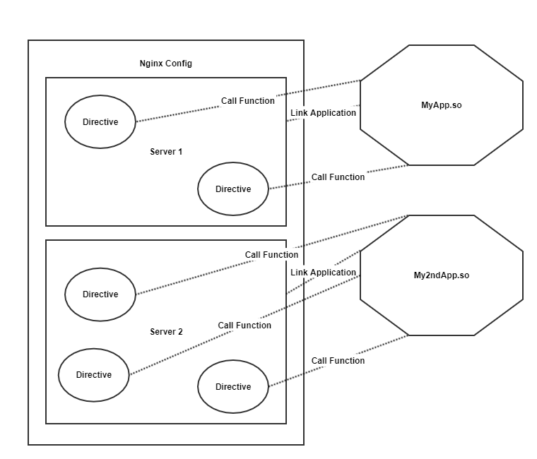

nginx-c-function
================

It is a NGINX module that allow you to link your .so(c/c++) application in server context and call the function of .so application in location directive.

Table of Contents
=================

* [Introduction](#introduction)
* [How it works](#how-it-works)
* [Usage](#usage)
* [Installation](#installation)
* [Sample Application Development](#sample-application-development)
* [Test](#test)
* [Copyright & License](#copyright--license)

Introduction
============

nginx-c-function is a nginx module which allow to link the .so(c/c++) application in nginx config, and call the function of .so file in location context area. Therefore, you could direct link your C/C++ application to nginx server.


How it works
============




Usage
=======
```nginx
# nginx.conf

server {
  listen 8888;
  ...
  ngx_http_c_func_link_lib "/home/dispatch/testMap/c-lib/nginx-c-function/t/libcfuntest.so";
  ...
  ...
  location = /testCFunGreeting {
      ngx_http_c_func_call "my_app_simple_get_greeting";
  }
}

server {
  listen 8989;
  ...
  ngx_http_c_func_link_lib "/home/dispatch/testMap/c-lib/nginx-c-function/t/libcfuntest.so"; # sharing with server 1
  ...
  ...
  location = /testCFunGreeting {
      ngx_http_c_func_call "my_app_simple_get_greeting";
  }
}

server {
  listen 8999;
  ...
  ngx_http_c_func_link_lib "/home/dispatch/testMap/c-lib/nginx-c-function/t/libcfuntest2.so"; # another application
  ...
  ...
  location = /testPost {
      add_header Allow "GET, POST, HEAD" always;
      if ( $request_method !~ ^(POST)$ ) {
        return 405;
      }
      ngx_http_c_func_call "my_2nd_app_simple_get_token";
  }
}
```


Installation
============

```bash
wget 'http://nginx.org/download/nginx-1.10.3.tar.gz'
tar -xzvf nginx-1.10.3.tar.gz
cd nginx-1.10.3/

./configure --add-module=/path/to/nginx-c-function

make -j2
sudo make install
```

#### ngx_http_c_func_module.h header not found when configure

When first time configure this project, I purposely do not include this header, you may need to install it to your c header file as this header file need to share with your .so application as well.

#### Example of installing header
```bash
install -m 644 /path/to/nginx-c-function/src/ngx_http_c_func_module.h /usr/local/include/
```


[Back to TOC](#table-of-contents)


Interface that expose to client application
============================================

This is the interface that you can use to get more details from nginx server, it all inside the ngx_http_c_func_module.h.

```c

#define ngx_http_c_func_content_type_plaintext "text/plain"
#define ngx_http_c_func_content_type_html "text/html; charset=utf-8"
#define ngx_http_c_func_content_type_json "application/json"
#define ngx_http_c_func_content_type_jsonp "application/javascript"
#define ngx_http_c_func_content_type_xformencoded "application/x-www-form-urlencoded"

typedef struct {
	char *args; // Uri Args
	u_char *body; // Request Body

	/* internal */
	void* __r__;
	intptr_t __rc__;
} ngx_http_c_func_request_t;

extern void ngx_http_c_func_log_debug(ngx_http_c_func_request_t* req, const char* msg);
extern void ngx_http_c_func_log_info(ngx_http_c_func_request_t* req, const char* msg);
extern void ngx_http_c_func_log_warn(ngx_http_c_func_request_t* req, const char* msg);
extern void ngx_http_c_func_log_err(ngx_http_c_func_request_t* req, const char* msg);
extern u_char* ngx_http_c_func_get_header(ngx_http_c_func_request_t* req, const char*key);
extern void* ngx_http_c_func_get_query_param(ngx_http_c_func_request_t *req, const char *key);
extern void* ngx_http_c_func_palloc(ngx_http_c_func_request_t* req, size_t size);
extern void* ngx_http_c_func_pcalloc(ngx_http_c_func_request_t* req, size_t size);

extern void ngx_http_c_func_write_resp(
    ngx_http_c_func_request_t* req,
    uintptr_t status_code,
    const char* status_line,
    const char* content_type,
    const char* resp_content
);

```

## Interface break down details

#### malloc/calloc from nginx pool
```c
void* ngx_http_c_func_palloc(ngx_http_c_func_request_t* req, size_t size);
void* ngx_http_c_func_pcalloc(ngx_http_c_func_request_t* req, size_t size);
```

#### get the request header parameter from 
```c
extern u_char* ngx_http_c_func_get_header(ngx_http_c_func_request_t* req, const char*key);
```

#### get the uri args
```c
req->args;
```

#### get the query parameter
```c
extern void* ngx_http_c_func_get_query_param(ngx_http_c_func_request_t *req, const char *key);
```

#### get the request body
```c
req->body;
```

#### loggin to nginx server
```c
extern void ngx_http_c_func_log_debug(ngx_http_c_func_request_t* req, const char* msg);
extern void ngx_http_c_func_log_info(ngx_http_c_func_request_t* req, const char* msg);
extern void ngx_http_c_func_log_warn(ngx_http_c_func_request_t* req, const char* msg);
extern void ngx_http_c_func_log_err(ngx_http_c_func_request_t* req, const char* msg);
```

#### Response out
```c
extern void ngx_http_c_func_write_resp(
    ngx_http_c_func_request_t* req,
    uintptr_t status_code, // Status code
    const char* status_line, // Status line
    const char* content_type, // Response content type
    const char* resp_content // Response content
);
```


Sample Application Development
===============================

```c
#include <stdio.h>
#include <ngx_http_c_func_module.h>

/*** build the program as .so library and copy to the preferred place for nginx to link this library ***/
/*** gcc -shared -o libcfuntest.so -fPIC cfuntest.c ***/
/*** cp libcfuntest.so /etc/nginx/ ***/

int count = 99;

void ngx_http_c_func_init() {
    ++count;
}


void my_app_simple_get_greeting(ngx_http_c_func_request_t* req) {
    ngx_http_c_func_log_info(req, "Calling back and log from my_app_simple_get");

    ngx_http_c_func_write_resp(
        req,
        200,
        "200 OK",
        "text/plain",
        "greeting from ngx_http_c_func testing"
    );
}

void my_app_simple_get_args(ngx_http_c_func_request_t* req) {
    ngx_http_c_func_log_info(req, "Calling back and log from my_app_simple_get_args");

    ngx_http_c_func_write_resp(
        req,
        200,
        "200 OK",
        "text/plain",
        req->args
    );
}

void my_app_simple_get_token_args(ngx_http_c_func_request_t* req) {
    ngx_http_c_func_log_info(req, "Calling back and log from my_app_simple_get_token_args");

    char * tokenArgs = ngx_http_c_func_get_query_param(req, "token");
    if (! tokenArgs) {
        ngx_http_c_func_write_resp(
            req,
            401,
            "401 unauthorized",
            "text/plain",
            "Token Not Found"
        );
    } else {
        ngx_http_c_func_write_resp(
            req,
            401,
            "401 unauthorized",
            "text/plain",
            tokenArgs
        );
    }
}

void my_app_simple_post(ngx_http_c_func_request_t* req) {
    ngx_http_c_func_log_info(req, "Calling back and log from my_app_simple_post");

    ngx_http_c_func_write_resp(
        req,
        202,
        "202 Accepted and Processing",
        "text/plain",
        req->body
    );
}


void my_app_simple_get_no_resp(ngx_http_c_func_request_t* req) {
    ngx_http_c_func_log_info(req, "Calling back and log from my_app_simple_get_no_resp");


}


void ngx_http_c_func_exit() {
    ++count;
}
```


Test
=====

It depends on nginx test suite libs, please refer [test-nginx](https://github.com/openresty/test-nginx) for installation.


```bash
cd /path/to/nginx-c-function
export PATH=/path/to/nginx-dirname:$PATH 
sudo prove -r t/
```

[Back to TOC](#table-of-contents)

Copyright & License
===================

Copyright (c) 2018, Taymindis <cloudleware2015@gmail.com>

This module is licensed under the terms of the BSD license.

All rights reserved.

Redistribution and use in source and binary forms, with or without
modification, are permitted provided that the following conditions are met:

1. Redistributions of source code must retain the above copyright notice, this
   list of conditions and the following disclaimer.
2. Redistributions in binary form must reproduce the above copyright notice,
   this list of conditions and the following disclaimer in the documentation
   and/or other materials provided with the distribution.

THIS SOFTWARE IS PROVIDED BY THE COPYRIGHT HOLDERS AND CONTRIBUTORS "AS IS" AND
ANY EXPRESS OR IMPLIED WARRANTIES, INCLUDING, BUT NOT LIMITED TO, THE IMPLIED
WARRANTIES OF MERCHANTABILITY AND FITNESS FOR A PARTICULAR PURPOSE ARE
DISCLAIMED. IN NO EVENT SHALL THE COPYRIGHT OWNER OR CONTRIBUTORS BE LIABLE FOR
ANY DIRECT, INDIRECT, INCIDENTAL, SPECIAL, EXEMPLARY, OR CONSEQUENTIAL DAMAGES
(INCLUDING, BUT NOT LIMITED TO, PROCUREMENT OF SUBSTITUTE GOODS OR SERVICES;
LOSS OF USE, DATA, OR PROFITS; OR BUSINESS INTERRUPTION) HOWEVER CAUSED AND
ON ANY THEORY OF LIABILITY, WHETHER IN CONTRACT, STRICT LIABILITY, OR TORT
(INCLUDING NEGLIGENCE OR OTHERWISE) ARISING IN ANY WAY OUT OF THE USE OF THIS
SOFTWARE, EVEN IF ADVISED OF THE POSSIBILITY OF SUCH DAMAGE.

[Back to TOC](#table-of-contents)
